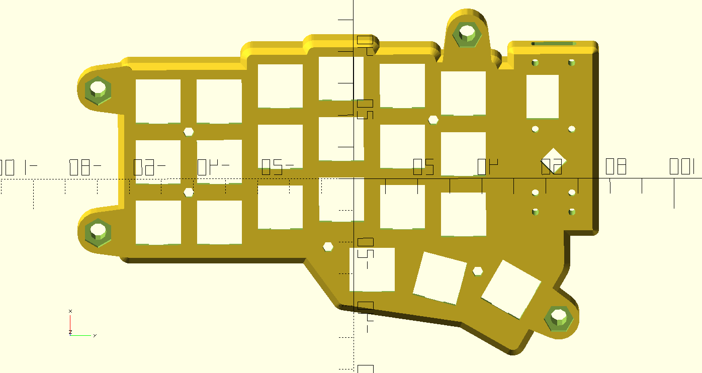
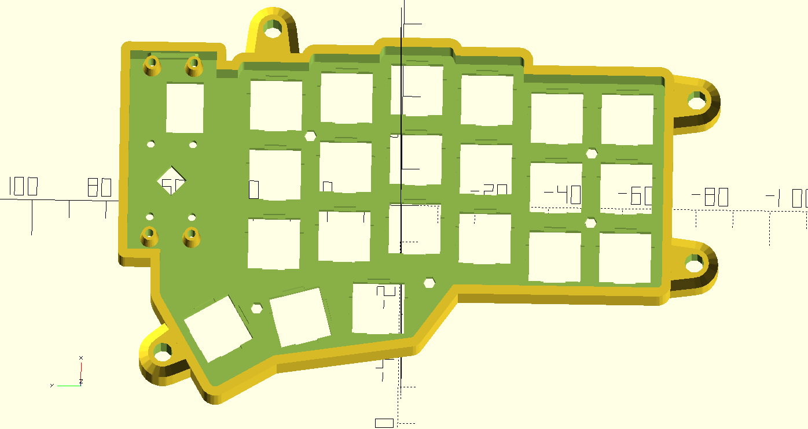

# Corne Keyboard Case Modified to use a Raspberry Pi Pico

This repository is a fork of https://github.com/Lenbok/scad-keyboard-cases .
That repository is set up to allow the generation of generalized keyboard cases using
a python script to generate a base OpenSCAD design. In this fork of the Lenbok repository some
steps were skipped there was already and example of a Corne case. I wanted that basic physical layout but 
also adjusted the case to permit the use of the Raspberry Pi Pico microcontroller board.

https://datasheets.raspberrypi.com/pico/pico-datasheet.pdf

* The Raspberry Pi Pico is a larger board that the one typically used on a Corne Keyboard. The outline of the board needed 
  to be expanded in the region of the MCU to accommodate the larger size.
    * Old Outline of Case
	  
    * New Outline of Case
	  
	 
## Pico-Corne Keyboard

### Under Construction

