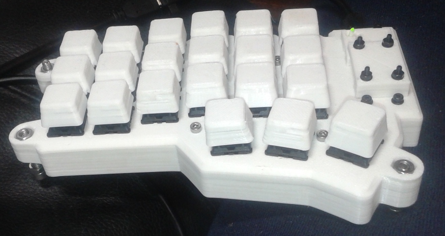
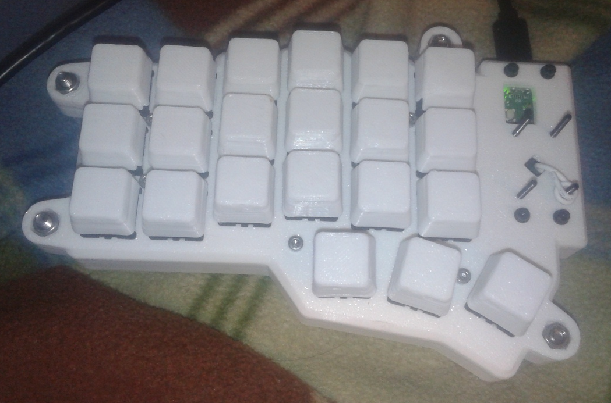

# Corne Inspired Keyboard Case Modified to use a Raspberry Pi Pico

 

This repository is a fork of https://github.com/Lenbok/scad-keyboard-cases .
That repository is set up to allow the generation of generalized keyboard cases using
a python script to generate a base OpenSCAD design. There was already and example of a Corne case in the original repository so I have used that example as a 
starting point. I wanted that basic physical switch layout but 
also adjusted the case to permit the use of the Raspberry Pi Pico microcontroller board. The Pico required more space than the orignal MCU.
A TPU shell and guard posts were added. Also added tending pegs and internal spacers (spacers go inside shell).

Screws were added to hold it together.

* M2 x16
* M2.5 to connect top to base x10 
* M4 with locking nuts for guard posts x8

Standoffs and holes for mounting the Pico board were added. Additional mounting holes were added for small removable covers to allow for future customization.
I am using the two sides of the keyboard without direct connection between them. One customization could possibly be to add connectors for connection to the other 
side of the keyboard.

* https://datasheets.raspberrypi.com/pico/pico-datasheet.pdf

Files created prior to 2024 are from the original repository. Files specific to this fork are all modified or created in 2024.

## Added Tenting Supports

 

Each side of the keyboard can be press fit into the tenting support. The supports are made of flexible TPU but have enough infill to be semi-rigid.
	 
## Pico-Corne Keyboard

 

* Light from RPi Pico board piped outside case by short piece of clear PETG filament.
* Covers over Pico board area allow for customization without reprinting whole case. Also contain side
  vents for convective cooling.
* Used crkbd/stls/crkbd-case-top-pico.stl and crkbd/stls/-case-base-pico.stl for left side keyboard. The same file can be mirrored in slicing software to create right side case.
* crkbd/stls/crkbd-case-top-pico.stl and crkbd/stls/cover_trrs.stl are used as is on both left and right sides.

 

### Construction

Image links to youtube! 

* The image above is a link to a youtube video showing how the parts of the left side of the keyboard go together. This video was created using Blender and as such is CGI.
* The images below are photographs of the actual physical keyboard.

#### Protective Shell

Added a TPU protective shell. The intent is to protect the PLA case from possible impacts from drops or knocks.

## Firmware

Firmware for this project can be found at https://github.com/danpeirce/pico-corne 

## Keycaps

Initially used the following keycaps
 
* [https://www.printables.com/model/808496-flat-top-keycaps-mx-cherry-with-cutouts-for-m25-sc](https://www.printables.com/model/808496-flat-top-keycaps-mx-cherry-with-cutouts-for-m25-sc)

but later found these ones which suited my split keyboard better:

* [https://www.printables.com/model/821325-cherry-mx-compatible-keycaps-flat-top](https://www.printables.com/model/821325-cherry-mx-compatible-keycaps-flat-top)

## Accommodate a Larger Microcontroller Board

* The Raspberry Pi Pico is a larger board that the one typically used on a Corne Keyboard. The outline of the board needed 
  to be expanded in the region of the MCU to accommodate the larger size.
    * Old Outline of Case
	  
    * New Outline of Case
	  